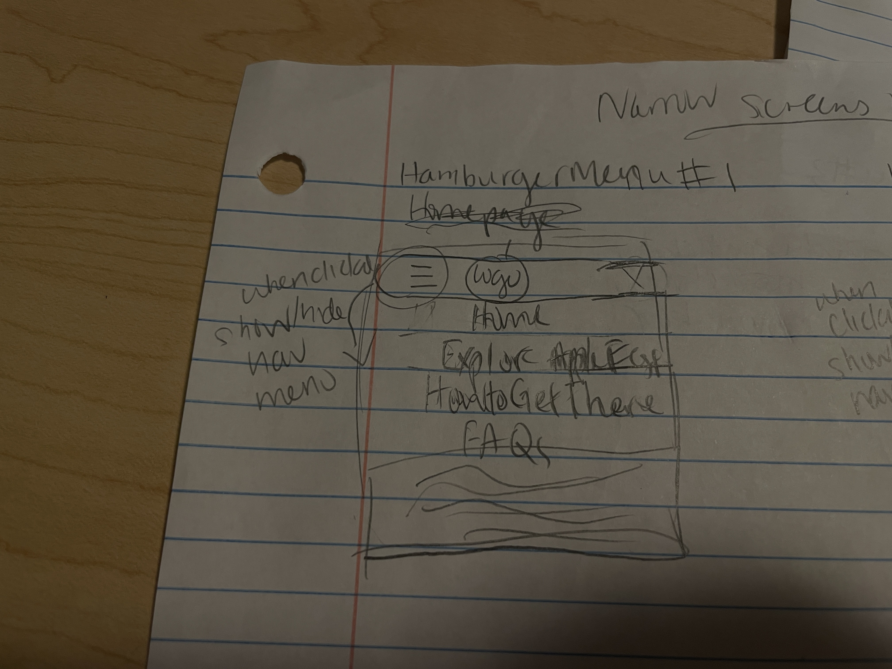
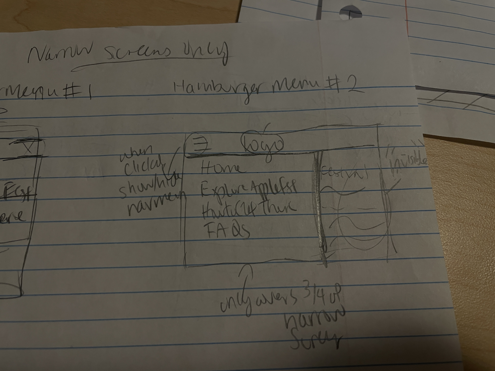
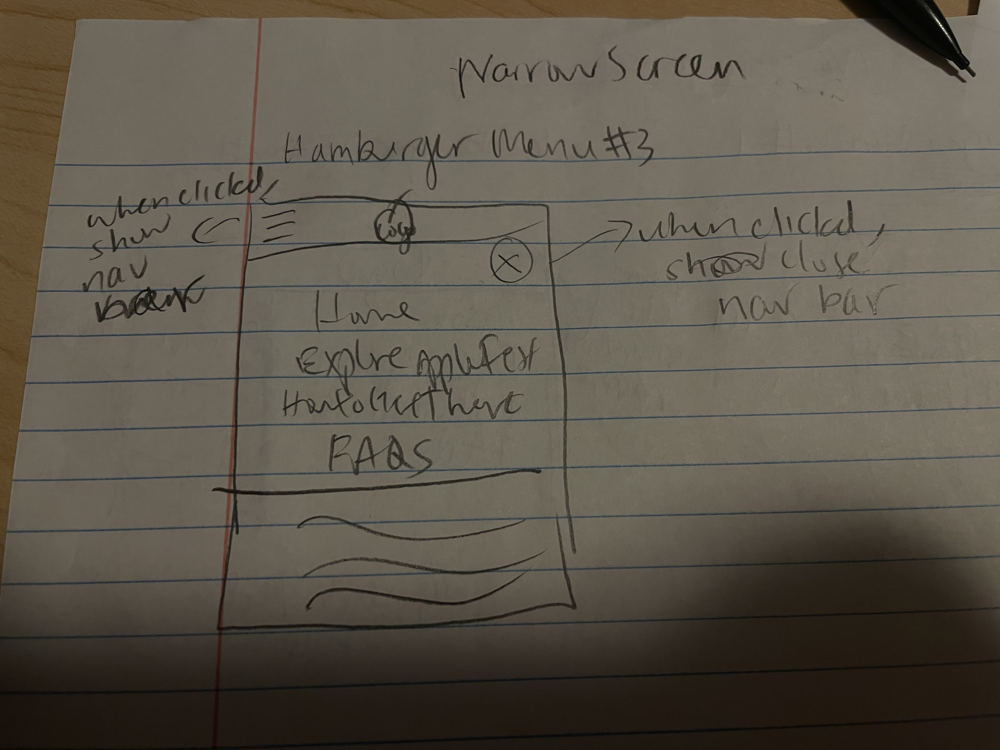
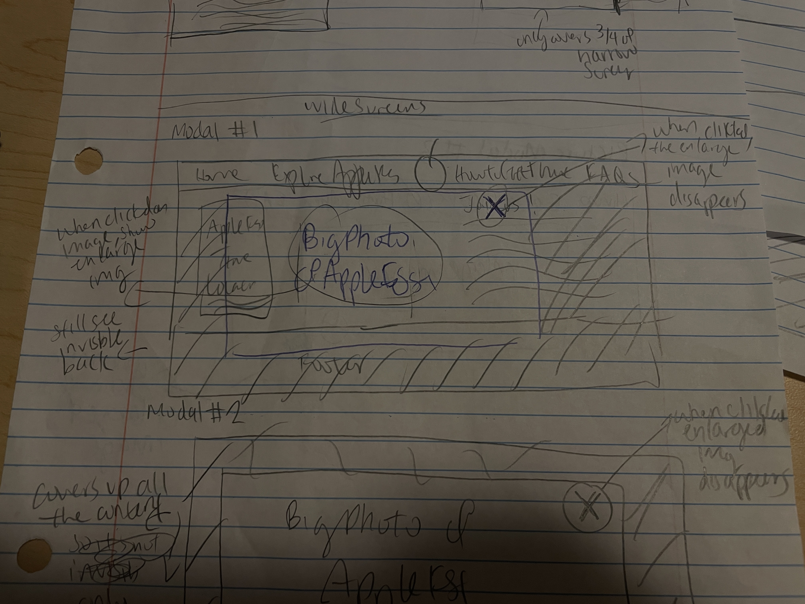
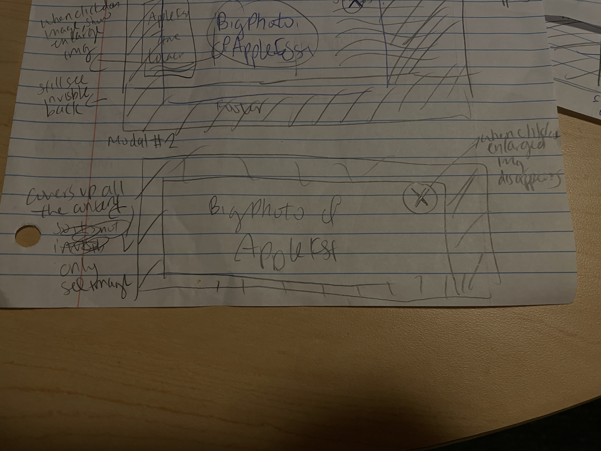
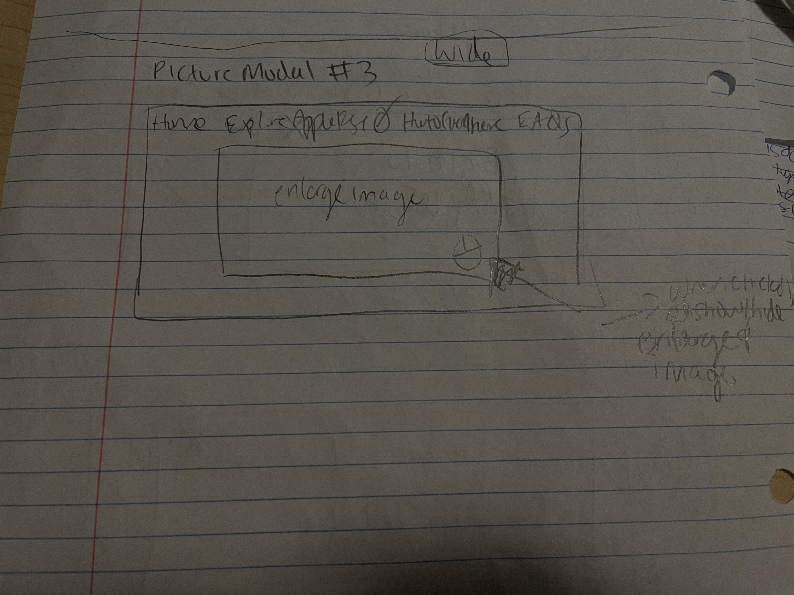
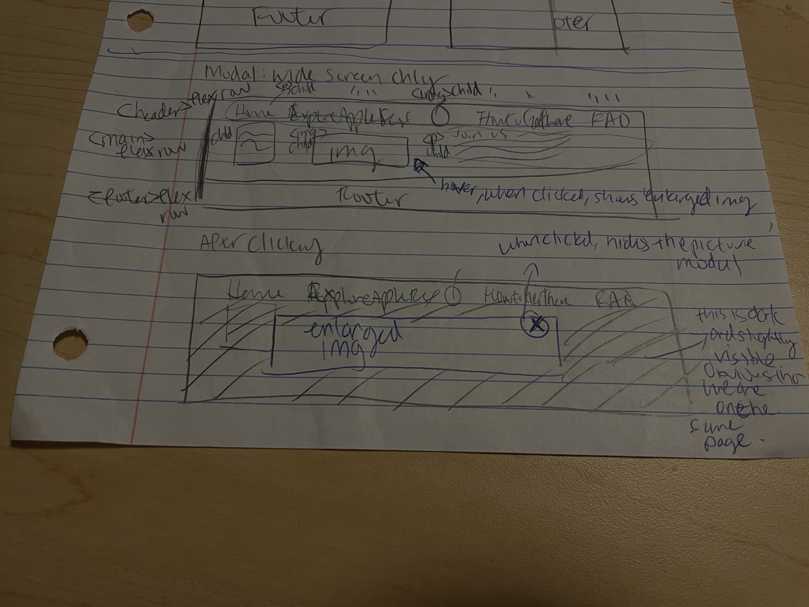
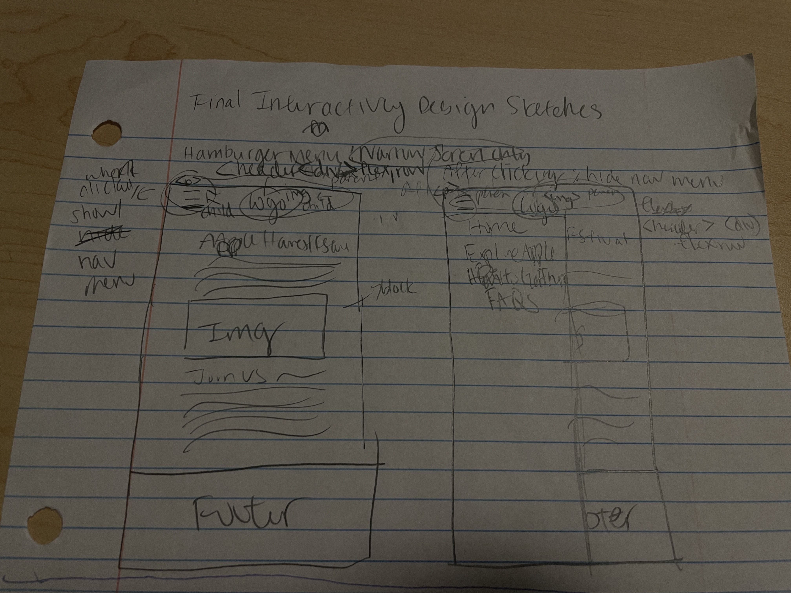
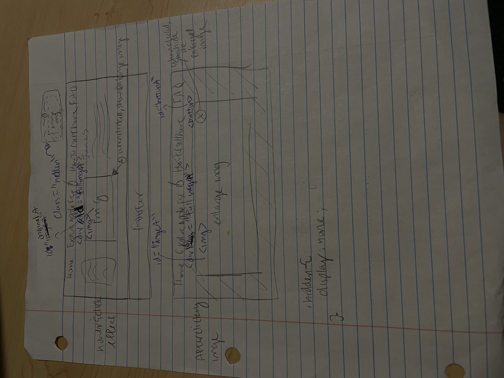
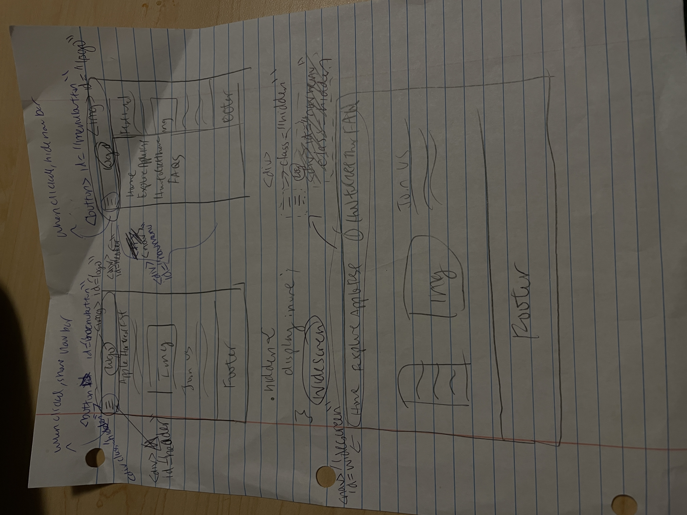

# Project 3: Design Journey

**For each milestone, complete only the sections that are labeled with that milestone.** Refine all sections before the final submission.

You are graded on your design process. If you later need to update your plan, **do not delete the original plan, leave it in place and append your new plan _below_ the original.** Then explain why you are changing your plan. Any time you update your plan, you're documenting your design process!

**Replace ALL _TODOs_ with your work.** (There should be no TODOs in the final submission.)

Be clear and concise in your writing. Bullets points are encouraged.

Place all design journey images inside the "design-plan" folder and then link them in Markdown so that they are visible in Markdown Preview.

**Everything, including images, must be visible in _Markdown: Open Preview_.** If it's not visible in the Markdown preview, then we can't grade it. We also can't give you partial credit either. **Please make sure your design journey should is easy to read for the grader;** in Markdown preview the question _and_ answer should have a blank line between them.


## Existing Project (Milestone 1)

**Tell us about the project you'll be using for Project 3.**

### Project (Milestone 1)
> Which project will you add interactivity to enhance the site's functionality?
>
> I will add interactivity to Project 2 since I feel like it is a more interesting website than my portfolio. Adding interactivity would enhance and make me reach more of the audience's goals.

### Audience (Milestone 1)
> Briefly explain your site's audience. (1-2 sentences)
> Be specific and justify why this audience is a **cohesive** group.
>
> My site's audience is people who are in or near Ithaca (either people who live in or near Ithaca locally, or students attending schools in Ithaca). It is a cohesive group because they all want to do something fun and enjoy their lives in Ithaca, where there are rarely any fun events to do. Thus, they will be the ones who will be the most interested in attending the festival and likely seeking out information about it. They want to make the most out of this experience and want to make their lives easier if website navigation is also easy. They want to get important information quickly and efficiently from the website to make their planning easier, so the website should be organized and easy to navigate.

### Audience's Goals (Milestone 1)
> List the audience's goals that you identified in Project 1 or 2.
> Simply list each goal. No need to include the "Design Ideas and Choices", etc.
> You may adjust the goals if necessary.
>
>- Goal 1: Easily access the detailed information of Apple Fest through easy to navigate website navigation with no distractions or unorganized content.
>- Goal 2: Easily be able to find information about Apple Fest on the day of at the event on their mobile devices.
>- Goal 3: Easily navigate the sections of the website that can help them plan their event hangout date.


## Interactivity Design (Milestone 1)

### Modal Interactivity Brainstorm (Milestone 1)
> Using the audience goals you identified, brainstorm possible options for **modal** interactivity to enhance the functionality of the site while also assisting the audience with their goals.
> Briefly explain each idea and provide a brief rationale for how the interactivity enhances the site's functionality for the audience. (1 sentence)
> Note: You may find it easier to sketch for brainstorming. That's fine too. Do whatever you need to do to explore your ideas.
>
>- For each picture, users can hover and tap on the image to see each enlarged picture more clearly. This way, people can look more closely about the details of the image and truly imagine themselves at the fun festival. They can also see where the place is located at with the Ithaca Commons image. This way, they won't get lost.
>- There will be a text under each picture that indicates that the user can tap the image in order to enlarge the image. This will help the users be able to look closely to the fun events and activities at the Apple Fest and use this to help them plan. Even smaller details such as the map would be helpful to look at and to zoom in on.
>- There can be a pop up model that shows an inviting message and quick details of the event. For example, it should say "Are you ready to embark on a journey, Press this button to start." This way, the users can know quickly the details of the event and be ready to explore the rest of the site.
>Final one: I chose the first idea because the second idea is a little too repetitive and similar to first idea. The thrid idea, after considering, might be really annoying to the users.


### Interactivity Design Ideation (Milestone 1)
> Explore the possible design solutions for the interactivity.
> Sketch at least two iterations of the modal and at least two iterations of the hamburger menu interactivity.
> Annotate each sketch explaining what happens when a user takes an action. (e.g. When user clicks this, something else appears.)
>
>Hamburger Menu 1:
>
>
>Hamburger Menu 2:
>
>
>Hamburger Menu 3:
>
>
>Modal 1:
>
>
>Modal 2:
>
>
>Modal 3:
>


### Final Interactivity Design Sketches (Milestone 1)
> Create _polished_ sketch(es) (it's still a sketch, but with a little more care taken to communicate ideas clearly to the graders) to plan your interactivity.
> **Sketch out the entire page where your interactivity will go.**
> Include your interactivity to the sketch(es).
> Add annotations to explain what happens when the user takes an action.
> Include as many sketches as necessary to communicate your design (ask yourself, could another 1300 take these sketches an implement my design?)
>
>**Modal design sketches:**
>
>
>**Hamburger drop-down navigation menu design sketches:**
>

### Interactivity Rationale (Milestone 1)
> Describe the purpose of your proposed interactivity.
> Provide a brief rationale explaining how your proposed interactivity addresses the goals of your site's audience.
> This should be about a paragraph. (2-4 sentences)
>
>In the end, I decided to propose the interactivity with a hamburger menu and a pictures modal. The hamburger menu will help make the website easy to navigate into sections for the audience on the day of the festival on the narrow screen, such as a mobile phone. For example, they can easily see the times, the maps, and checking last minute information easily. The picture modal on the wide screen will make the audience immerse themselves in imagining the festival happening and making it easier to see small details such as how the food vendors are set up, where the activites are on the map, etc. This would help making planning for this event quicker and more efficient.


## Interactivity Implementation Plan (Milestone 1)

### Interactivity Planning Sketches (Milestone 1)
> Produce planning sketches that include all the details another 1300 student would need to implement your interactivity design.
> Your planning sketches should include _all_ HTML elements needed for the interactivity; _annotations_ for the element types, their unique IDs, and CSS classes; and lastly the initial CSS classes.
>
>**Modal planning sketches:**
>
>
>**Hamburger drop-down navigation menu planning sketches:**
>
>

### Interactivity Pseudocode Plan (Milestone 1)
> Write your interactivity pseudocode plan here.
> Pseudocode is not JavaScript. Do not put JavaScript code here.

**Modal pseudocode:**

Open the modal:

```
when #originalA is clicked:
    remove .hidden from #fullimageA
```

Close the modal:

```
when #buttonA is clicked:
    add .hidden to #fullimageA
```

**Hamburger menu pseudocode:**

Pseudocode to show/hide (toggle) the navigation menu (narrow screens):

```
when #menubutton is clicked:
    if #navmenu is .hidden:
        remove .hidden from #navmenu
    else:
        add .hidden to #navmenu
```

Pseudocode to hide the hamburger button and show the navigation bar when the window is resized too wide:

```
when window is resized and greater than 850px:
    Add .hidden to #menubutton
    Remove .hidden from #navmenu

```

Pseudocode to show the hamburger button and hide the navigation menu when the window is resized too narrow:

```
when window is resized and less than 850px:
    Remove .hidden to #menubutton
    Add .hidden to #navmenu
```


## Grading (Final Submission)

### Interactivity Usability Justification (Final Submission)
> Explain how your design effectively uses affordances, visibility, feedback, and familiarity.
> Write a paragraph (3-5 sentences)

TODO: interactivity rationale


### Tell Us What to Grade (Final Submission)
> We aren't re-grading your Project 1 or 2.
> We are only grading the interactivity you added.
> Tell us where (what pages) we can find your interactivity and how to use it.
> **We will only grade what you list here;** if it's not listed, we won't grade it.

TODO: what should we grade


### Collaborators (Final Submission)
> List any persons you collaborated with on this project.

TODO: list your collaborators


### Reference Resources (Final Submission)
> Please cite any external resources you referenced in the creation of your project.
> (i.e. W3Schools, StackOverflow, Mozilla, etc.)

TODO: list reference resources


### Self-Reflection (Final Submission)
> This was the first project in this class where you coded some JavaScript. What did you learn from this experience?

TODO: self-reflection


> Take some time here to reflect on how much you've learned since you started this class. It's often easy to ignore our own progress. Take a moment and think about your accomplishments in this class. Hopefully you'll recognize that you've accomplished a lot and that you should be very proud of those accomplishments!

TODO: self-reflection
